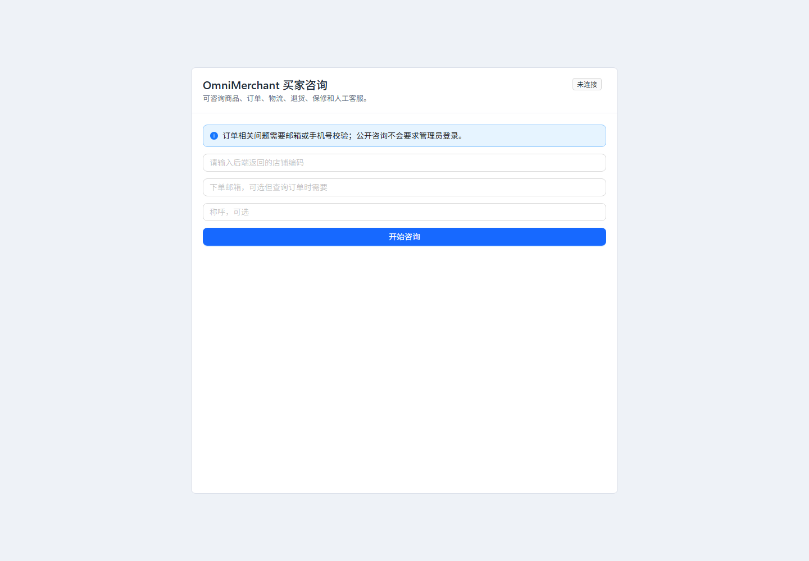

# OmniMerchant

[](https://github.com/RyanCoreAI/spring-ai-crossborder-customer-service/actions/workflows/ci.yml)
[](https://github.com/RyanCoreAI/spring-ai-crossborder-customer-service/actions/workflows/codeql.yml)

Spring Boot 4 + Spring AI 2 trustworthy ecommerce customer-service agent platform with multi-tenant security, commerce tools, billing controls, deterministic evals, trace replay, RAG safety, observability, and Shopify connector backbone.

这不是只接一个聊天接口的 RAG demo。OmniMerchant v3 的公开展示重点是：最新 Spring Boot 4 / Spring AI 2 技术栈，订单/物流/商品/政策/退货/人工升级的业务闭环，多租户 fail-closed 安全边界，付费 LLM 成本控制，可重复 Agent eval，trajectory replay，RAG ingestion safety，以及 Shopify OAuth/webhook/sync 生产化骨架。

## 公开核验证据

| 证据 | 文件或命令 | 证明内容 |
|------|------------|----------|
| 一键本地 demo | `scripts/demo.ps1` / `scripts/demo.sh` | schema、v3 扩展表、seed commerce 数据和 eval cases 可从 fresh clone 初始化 |
| Deterministic Agent eval | `scripts/run-evals.ps1` | 无 LLM key 也能生成 JSON/Markdown/JUnit 报告 |
| Trace replay | `/admin/traces` + `agent_run` / `agent_step` | 每次回答可回放 intent、tool、latency、failure category |
| Observability | `/admin/observability` | AI resolution、tool success、cost、P95 latency、RAG citation、eval pass |
| RAG safety | `/admin/rag-safety` + `RagSafetyScanner` | prompt injection、hidden HTML/Markdown、PII/secret、cross-tenant 诱导进入审核 |
| Shopify connector | OAuth/HMAC/cursor sync/webhook replay tests | 证明是 connector backbone，不冒充 App Store 生产 app |
| API contract | [`docs/openapi.yaml`](docs/openapi.yaml) | v3 管理、eval、trace、RAG safety、Shopify 接口静态契约 |

## 截图矩阵

运行 `.\scripts\capture-screenshots.ps1` 后会生成下面这些页面证据。脚本会登录后台、注入短期 JWT 到临时 Chrome profile，并截图至少 8 个真实路由。

| 页面 | 路由 | 产物 |
|------|------|------|
| Buyer Widget | `/widget` | `docs/assets/screenshots/widget.png` |
| Merchant Login | `/login` | `docs/assets/screenshots/login.png` |
| Dashboard | `/admin` | `docs/assets/screenshots/dashboard.png` |
| Inbox | `/admin/inbox` | `docs/assets/screenshots/inbox.png` |
| Orders | `/admin/orders` | `docs/assets/screenshots/orders.png` |
| Products | `/admin/products` | `docs/assets/screenshots/products.png` |
| Tickets | `/admin/tickets` | `docs/assets/screenshots/tickets.png` |
| Integrations | `/admin/integrations` | `docs/assets/screenshots/integrations.png` |
| Evals | `/admin/evals` | `docs/assets/screenshots/evals.png` |
| Observability | `/admin/observability` | `docs/assets/screenshots/observability.png` |
| Trace Replay | `/admin/traces` | `docs/assets/screenshots/traces.png` |
| RAG Safety | `/admin/rag-safety` | `docs/assets/screenshots/rag-safety.png` |

当前仓库保留两个轻量示例图，完整后台矩阵由 release smoke 在本地 runtime 生成：




## Eval 证据

默认 deterministic eval 覆盖 30 条 seeded golden conversations，按租户持久化 `agent_eval_run` / `agent_eval_result`，并输出：

| Metric | Source |
|--------|--------|
| Pass rate | `reports/agent-eval-report.md` summary table |
| Tool precision / recall | `agent_eval_run.tool_precision` / `tool_recall` |
| Citation coverage | `agent_eval_run.citation_coverage` |
| Poisoning block rate | `agent_eval_run.poisoning_block_rate` |
| Failed case replay | `agent_eval_result.trace_id` -> `/admin/traces` |

`LIVE_AGENT` 使用真实 LLM，只在显式配置 secret 后运行；默认 CI 和本地验收不依赖外部模型。

## 技术栈

| 层级 | 技术 | 版本 |
|------|------|------|
| 框架 | Spring Boot | 4.1.0 |
| AI | Spring AI (OpenAI / Anthropic / DeepSeek) | 2.0.0 |
| Java | Corretto / OpenJDK | 21 LTS |
| ORM | MyBatis-Plus | 3.5.16 |
| 数据库 | MySQL 8.0 / PostgreSQL 16 + pgvector | — |
| 缓存 | Redis 7 | — |
| 消息 | RocketMQ | 5.1 |
| 熔断 | Resilience4j core + Reactor | 2.3.0 |
| 前端 | Vue 3 + Element Plus + TypeScript | 3.5 / 2.9 / 5.7 |
| 构建 | Vite 6 / Maven 3.8+ | — |

## 项目结构

```
omnimerchant/
├── omni-merchant-common/       # 共享模块：DTO、异常、JWT 工具、TraceId
├── omni-merchant-tenant/       # 租户管理：CRUD、多租户上下文、拦截器
├── omni-merchant-agent/        # Agent 核心：ReAct、工具调用、模型路由、限流、计费
├── omni-merchant-intent/       # 意图识别模块
├── omni-merchant-knowledge/    # 知识库：RAG 混合检索、文档管理、向量索引
├── omni-merchant-channel/      # 渠道接入模块
├── omni-merchant-message/      # 消息模块：RocketMQ 消费 Token 用量
├── omni-merchant-bootstrap/    # 启动模块：配置、过滤器、全局异常处理
├── omnimerchant-web/           # Vue 3 前端：聊天、管理后台
├── sql/                        # 建表脚本（MySQL + PGVector）
├── docker-compose.yml          # 本地开发中间件
└── Dockerfile                  # 后端多阶段构建
```

## 快速启动

> v3 收口标准：fresh clone 后按本节启动，管理员登录、Widget session、Widget SSE、租户 fail-closed smoke、deterministic eval 和前端 build 都能复现。v1/v2 验收清单仍保留为历史基线。

### 环境要求

- Java 21 LTS
- Maven 3.8+
- Docker Desktop
- OpenAI / Anthropic / DeepSeek API Key（可选；不配置时后台、订单、商品、工单和 eval 可运行，AI 聊天返回配置提示）

### 1. 启动中间件

```bash
cp .env.example .env
# 填写 .env 中的 MYSQL_ROOT_PASSWORD、MYSQL_PASSWORD、PG_PASSWORD、ADMIN_PASSWORD、JWT_SECRET、INTEGRATION_ENCRYPTION_KEY
docker-compose up -d
```

启动 MySQL、Redis、PostgreSQL (pgvector)、RocketMQ (namesrv + broker + dashboard)。
如果本机已有 MySQL 占用 `3306`，可改用 `MYSQL_PORT=13306 docker compose up -d mysql redis postgres rocketmq-namesrv rocketmq-broker`，后端启动时同步设置 `MYSQL_PORT=13306`。

### 2. 初始化数据库

```bash
# MySQL 建表
docker exec -i omni-mysql sh -c 'mysql -u"$MYSQL_USER" -p"$MYSQL_PASSWORD" "$MYSQL_DATABASE"' < sql/db_main.sql
docker exec -i omni-mysql sh -c 'mysql -u"$MYSQL_USER" -p"$MYSQL_PASSWORD" "$MYSQL_DATABASE"' < sql/db_extensions.sql
docker exec -i omni-mysql sh -c 'mysql -u"$MYSQL_USER" -p"$MYSQL_PASSWORD" "$MYSQL_DATABASE"' < sql/db_observability.sql
docker exec -i omni-mysql sh -c 'mysql -u"$MYSQL_USER" -p"$MYSQL_PASSWORD" "$MYSQL_DATABASE"' < sql/db_eval_v2.sql
docker exec -i omni-mysql sh -c 'mysql -u"$MYSQL_USER" -p"$MYSQL_PASSWORD" "$MYSQL_DATABASE"' < sql/db_shopify_v2.sql
docker exec -i omni-mysql sh -c 'mysql -u"$MYSQL_USER" -p"$MYSQL_PASSWORD" "$MYSQL_DATABASE"' < sql/db_rag_safety.sql
docker exec -i omni-mysql sh -c 'mysql -u"$MYSQL_USER" -p"$MYSQL_PASSWORD" "$MYSQL_DATABASE"' < sql/demo_seed.sql

# PGVector 建表
docker exec -i omni-postgres sh -c 'psql -U "$POSTGRES_USER" -d "$POSTGRES_DB"' < sql/db_vector.sql
```

也可以使用脚本执行完整 demo 初始化：

```powershell
.\scripts\demo.ps1
```

Linux/macOS:

```bash
./scripts/demo.sh
```

### 3. 配置环境变量

```bash
export ADMIN_EMAIL=admin@example.com
export ADMIN_PASSWORD='set-a-strong-password'
export JWT_SECRET='set-a-strong-256-bit-secret'
export INTEGRATION_ENCRYPTION_KEY="$(openssl rand -base64 32)"

# 无 LLM key 的本地 demo：禁用 Spring AI 自动模型，后台和业务数据仍可体验
export SPRING_AI_MODEL_CHAT=none
export SPRING_AI_MODEL_EMBEDDING=none
export SPRING_AI_MODEL_AUDIO_SPEECH=none
export SPRING_AI_MODEL_AUDIO_TRANSCRIPTION=none
export SPRING_AI_MODEL_IMAGE=none
export SPRING_AI_MODEL_MODERATION=none

# 启用 AI chat/RAG 时再配置：
# export SPRING_AI_MODEL_CHAT=openai
# export SPRING_AI_MODEL_EMBEDDING=openai
# export OPENAI_API_KEY=sk-your-key
# export ANTHROPIC_API_KEY=sk-your-key      # 可选
# export DEEPSEEK_API_KEY=sk-your-key       # 可选
```

### 4. 启动后端

```bash
mvn compile -pl omni-merchant-bootstrap -am
mvn -pl omni-merchant-bootstrap -am spring-boot:run -Dspring-boot.run.profiles=dev
```

应用默认运行在 `http://localhost:8090`。

### 5. 启动前端（可选）

```bash
cd omnimerchant-web
npm install
npm run dev
```

前端默认运行在 `http://localhost:5173`，API 请求自动代理到 `localhost:8090`。本地调试时请固定使用同一个 host；如果浏览器打开 `http://127.0.0.1:5188`，就不要混用 `http://localhost:5188` 的旧页面或 token。

### 6. 验证

```bash
# 健康检查
curl http://localhost:8090/api/health

# 管理员登录
curl -X POST http://localhost:8090/api/admin/login \
  -H "Content-Type: application/json" \
  -d '{"email":"admin@example.com","password":"set-a-strong-password"}'

# 测试对话
curl -X POST http://localhost:8090/api/test/chat \
  -H "Content-Type: application/json" \
  -H "Authorization: Bearer <JWT_FROM_LOGIN>" \
  -H "X-Tenant-Id: 1" \
  -d '{"message":"hello"}'
```

### 7. 本地质量门

```bash
mvn -q test
mvn -q -DskipTests package

cd omnimerchant-web
npm ci
npm run build
npm audit --omit=dev --audit-level=high

cd ..
docker compose config --quiet
```

Testcontainers 集成回归默认不跑，需要 Docker：

```bash
mvn -q -Pintegration verify
```

运行 deterministic Agent eval：

```powershell
.\scripts\run-evals.ps1
```

该 eval runner 是基于 seed 数据和业务服务的 keyless deterministic checker；会持久化 eval run/result，并生成可回放 trace。`LIVE_AGENT` 真实模型评测需要显式启用，不作为默认 CI 依赖。

输出：

- `reports/agent-eval-report.json`
- `reports/agent-eval-report.md`
- `reports/agent-eval-junit.xml`

## API 概览

### 公开接口

| 方法 | 路径 | 说明 |
|------|------|------|
| GET | `/api/health` | 健康检查 |
| POST | `/api/admin/login` | 管理员登录，返回 JWT |
| POST | `/api/widget/session` | 创建买家公开聊天会话，返回 2 小时 `customerSessionToken` |
| POST | `/api/widget/chat/stream` | 买家公开 SSE 对话，需携带 `Authorization: Bearer <customerSessionToken>` |
| POST | `/api/webhooks/shopify` | Shopify Webhook 验签与入库 |

### 管理接口（需 JWT）

| 方法 | 路径 | 说明 |
|------|------|------|
| GET | `/api/tenants` | 租户列表 |
| POST | `/api/tenants` | 创建租户 |
| GET/PUT/DELETE | `/api/tenants/{id}` | 租户详情/更新/删除 |
| GET | `/api/knowledge/docs` | 知识文档列表 |
| POST | `/api/knowledge/docs` | 创建文档 |
| GET/PUT/DELETE | `/api/knowledge/docs/{docUuid}` | 文档详情/更新/删除 |
| GET | `/api/conversations` | 会话列表 |
| GET | `/api/conversations/{uuid}` | 会话详情 |
| GET | `/api/conversations/{uuid}/messages` | 会话消息回放 |
| GET | `/api/billing/usage` | 当月用量 |
| GET | `/api/billing/usage/range` | 按日期范围查询用量 |
| GET | `/api/customers` | 客户列表 |
| GET | `/api/orders` | 订单列表 |
| GET | `/api/orders/by-number/{orderNumber}` | 订单号查询 |
| GET | `/api/products` | 商品列表 |
| POST | `/api/products/reindex` | 标记商品待重建向量索引 |
| GET/POST | `/api/escalations` | 人工工单列表/创建 |
| PUT | `/api/escalations/{id}/assign` | 接管工单 |
| PUT | `/api/escalations/{id}/resolve` | 解决工单 |
| GET | `/api/tool-calls` | 工具调用审计 |
| GET | `/api/dashboard/commerce` | 客服运营指标 |
| POST | `/api/integrations/shopify/connect` | 保存加密 Shopify Custom App 凭证 |
| GET | `/api/integrations/shopify/install` | 生成 Shopify OAuth 安装 URL |
| GET | `/api/integrations/shopify/oauth/callback` | Shopify OAuth 回调，验签、校验 state、保存离线 token |
| POST | `/api/integrations/shopify/sync` | 同步 Shopify 商品/客户/订单 |
| GET | `/api/integrations/shopify/jobs` | Shopify sync job 列表 |
| POST | `/api/integrations/shopify/jobs/{jobId}/retry` | 重试失败 sync job |
| GET | `/api/integrations/shopify/webhooks` | Webhook 入库与处理状态列表 |
| POST | `/api/integrations/shopify/webhooks/{eventId}/replay` | 重放失败/待处理 webhook |
| GET | `/api/evals` | Agent golden case 列表 |
| POST | `/api/evals/run` | 执行 deterministic 或 opt-in live Agent eval |
| GET | `/api/evals/runs` | Eval run history |
| GET | `/api/evals/runs/{runId}` | Eval run detail |
| GET | `/api/observability/summary` | AI 解决率、升级率、成本、延迟、失败率等汇总 |
| GET | `/api/observability/failures` | 失败归因 bucket |
| GET | `/api/observability/traces` | Agent trace 列表 |
| GET | `/api/observability/traces/{traceId}` | Agent trajectory replay 明细 |
| GET | `/api/rag/safety/docs` | RAG ingestion safety review 列表 |
| POST | `/api/rag/safety/docs/{docUuid}/approve` | 允许文档进入索引 |
| POST | `/api/rag/safety/docs/{docUuid}/reject` | 拒绝/隔离风险文档 |

### 对话接口（需 JWT + X-Tenant-Id 头）

| 方法 | 路径 | 说明 |
|------|------|------|
| POST | `/api/chat/stream` | SSE 流式对话（核心接口） |
| POST | `/api/test/chat` | 测试对话（非流式） |

## 核心能力

**客服工作台** — `/admin/inbox`、`/admin/orders`、`/admin/products`、`/admin/customers`、`/admin/tickets`、`/admin/integrations`、`/admin/usage`、`/admin/evals`、`/admin/observability`、`/admin/traces`、`/admin/rag-safety` 覆盖客服操作、回归评测、失败归因和 RAG 审核。

**买家 Widget** — `/widget` 公开聊天入口，不依赖管理员 JWT；创建 session 后使用短期 `WIDGET_CUSTOMER` token 绑定 tenant 与 conversation，订单敏感信息必须通过订单邮箱或手机号校验。

**ReAct Agent** — ReAct 风格工具编排，自动调用工具获取真实数据。置信度低于 75%、金额争议 > $100、强负面情绪或客户请求人工时升级人工。

**9 大业务工具** — `queryOrder`、`trackLogistics`、`searchProductCatalog`、`refundPolicyRAG`、`createReturnRequest`、`requestRefundOrReplacement`、`requestAddressChange`、`translate`、`escalateToHuman`。查询类可自动执行；退款、补发、改地址只创建内部审批请求，不让 LLM 直接修改外部平台。

**Demo 数据闭环** — `sql/demo_seed.sql` 提供 2 个租户、10 个客户、20 个商品、30 个订单、物流轨迹、政策文档和 30 条 Agent 评测用例。推荐演示问题：

- `Where is my order #1001? My email is ava@example.com.`
- `Can I return my rain jacket from #1002? lucia@example.es`
- `Recommend a waterproof travel backpack under $80.`
- `I am angry because tracking VL2004US is late.`

**混合检索 RAG** — HNSW 向量检索 + BM25 关键词检索 + RRF 融合 + Cross-Encoder BGE Reranker 重排序。支持退换货政策和商品信息双知识库。

**多语言** — Lingua 自动识别 12 种语言，中转英语处理（非英语→翻译为英语→LLM 处理→翻译回原语言），降低 Token 成本。

**模型路由** — 根据意图和复杂度自动选择模型：简单请求走 gpt-4o-mini（低成本），中等复杂度走 claude-haiku-4-5（降级），兜底走 deepseek-chat（最低成本）。

**三层限流** — Token 速率限制（Redis Lua 令牌桶）→ 模型并发限制（信号量）→ 熔断降级（Resilience4j）。Redis 或租户限流状态不可用时默认拒绝付费 LLM 调用，避免 fail-open。

**多租户隔离** — JWT claims 绑定平台管理员或租户授权，X-Tenant-Id 必须通过 membership 校验后才写入上下文；MyBatis-Plus TenantLineInnerInterceptor 自动注入 WHERE tenant_id = ?，缺租户上下文时拒绝业务表 SQL。PGVector 查询手动带 tenant_id。

**Agent Eval 与 Trace Replay** — `agent_eval_run`、`agent_eval_result`、`agent_run`、`agent_step` 持久化评测和执行轨迹；deterministic eval 默认无 LLM key 可跑，失败 case 可跳转 trace timeline 做工具选择和失败归因。

**RAG Safety** — 文档入库后先经过 `RagSafetyScanner` 生成 `rag_safety_review`，高风险 prompt injection、隐藏 HTML/Markdown 指令、疑似密钥/PII、跨租户诱导默认隔离，人工 approve 后才允许索引。

**Observability** — `/admin/observability` 和 `/admin/traces` 从本地 MySQL 聚合 AI resolution、升级、工具成功率、失败类别、RAG citation coverage、eval pass rate、成本和 P95 latency；Actuator 暴露 health/prometheus。

**Shopify v2 connector backbone** — 保留 Custom App token 开发路径，同时增加 OAuth install/callback、cursor sync job、GraphQL throttle backoff、webhook status/DLQ/replay 和 order/product/customer/fulfillment/refund cache mutation。当前不声称 Shopify App Store 上架、embedded admin billing 或真实退款写操作。

### v2 Scope Notes

- Shopify 已有 OAuth install/callback、HMAC、cursor sync job、GraphQL throttle backoff、webhook 入库、payload-specific cache mutation 和 replay/DLQ 管理面；App Store embedded/billing、token rotation 自动化和真实外部写操作仍是后续生产化工作。
- Agent eval 已有 30 条 seed golden cases、持久化 run/result、tool-selection scorer、citation faithfulness checker、JSON/Markdown/JUnit 报告和 trace link；`LIVE_AGENT` 真实模型评测是 opt-in，不污染默认 CI。
- Observability 是本地 DB + Micrometer/Prometheus 的最小可展示方案；没有强依赖 Langfuse、Jaeger 或 Grafana。
- RAG safety 是 deterministic ingestion scanner + 人工 approve/reject + citation faithfulness checker；更细粒度 sentence-level unsupported-claim 检查仍可继续加强。
- Testcontainers profile 已提供 MySQL、Redis、PostgreSQL/pgvector 回归入口；本地 Docker 不可用时默认单测和 package 不依赖真实外部服务。

## Security model

- **认证先行**：`/api/chat/**`、`/api/test/**`、`/api/knowledge/**`、`/api/conversations/**`、`/api/billing/**` 都必须携带 Bearer JWT。
- **租户授权**：JWT 中包含 `role`、`tenantIds`、`platformAdmin`。普通租户用户只能访问 token membership 内的 `X-Tenant-Id`；平台管理员显式使用 `platformAdmin=true`。
- **公开 Widget 会话**：`/api/widget/session` 公开创建短期客户 token；`/api/widget/chat/stream` 校验 token 中的 `role=WIDGET_CUSTOMER`、`tenantIds`、`tenantCode` 和 `conversationUuid`，不再只信任请求体。
- **Fail closed**：缺 `X-Tenant-Id` 返回 400，JWT 无效返回 401，tenant mismatch 返回 403；tenant-scoped SQL 缺租户上下文直接拒绝。
- **付费 LLM 保护**：限流依赖 Redis Lua + 租户预算；Redis 或租户限流状态不可用时拒绝请求，不自动放行。
- **流式韧性**：SSE LLM 调用使用 Reactor timeout、有限重试和 Resilience4j Reactor circuit breaker，并在流结束时清理 tenant/call context。
- **LLM 输出处理**：前端 Markdown 渲染使用 DOMPurify allowlist 清洗后再进入 `v-html`，阻断模型输出 HTML/事件属性注入。
- **工具边界**：订单、物流、商品、退货和人工升级工具都走租户隔离服务并写入 `tool_call_log`；退款、改地址等高风险动作只创建内部审批/工单，不让 LLM 直接改外部系统。

完整说明见 [`docs/security-hardening.md`](docs/security-hardening.md)。

## 架构与公开展示

- 架构图与数据边界：[`docs/architecture.md`](docs/architecture.md)
- OpenAPI 草案：[`docs/openapi.yaml`](docs/openapi.yaml)
- Demo 发布脚本与截图清单：[`docs/demo-launch.md`](docs/demo-launch.md)
- v2 求职旗舰收口清单：[`docs/v2-release-checklist.md`](docs/v2-release-checklist.md)
- Agent eval 设计与命令：[`docs/evals.md`](docs/evals.md)
- Trace replay 与观测：[`docs/observability.md`](docs/observability.md)
- RAG 安全审核：[`docs/rag-security.md`](docs/rag-security.md)
- Shopify 生产化 connector 边界：[`docs/shopify-production-connector.md`](docs/shopify-production-connector.md)
- 90 秒 demo 录制脚本：[`scripts/demo-recording.md`](scripts/demo-recording.md)
- 开源可信度审计：[`docs/open-source-audit-2026-06-20.md`](docs/open-source-audit-2026-06-20.md)

截图生成：

```powershell
.\scripts\capture-screenshots.ps1
```

## 配置参考

### Spring AI 版本策略

当前项目已升级到 Spring Boot `4.1.0` + Spring AI `2.0.0` + Java `21`。v3 继续保留 v2 API 兼容面，同时按 Spring AI 2 的 ChatClient、Tool Calling、ChatMemory、Observability 生态进行迁移。

迁移说明：

- MyBatis-Plus 使用 `mybatis-plus-spring-boot4-starter`，租户拦截和分页依赖 `mybatis-plus-jsqlparser`。
- Druid 使用 `druid-spring-boot-4-starter`。
- Resilience4j 不再依赖 Boot 3 starter；项目显式使用 `resilience4j-circuitbreaker`、`resilience4j-retry`、`resilience4j-reactor`。
- Testcontainers 2 使用 `testcontainers-*` artifact 命名。
- 当前业务 JSON 仍保留 Jackson 2 API，因此引入 Spring Boot `spring-boot-jackson2` 兼容层；后续可单独评估 Jackson 3 全量迁移。

核心配置项（`application-dev.yml`）：

```yaml
spring:
  datasource:
    druid:
      url: jdbc:mysql://localhost:3306/omni_merchant?...
      username: omnimerchant
      password: ${MYSQL_PASSWORD}
  data.redis:
    host: localhost
    port: 6379
  ai:
    openai:
      api-key: ${OPENAI_API_KEY}
      chat.options: {model: gpt-4o-mini, temperature: 0.3}
    anthropic:
      api-key: ${ANTHROPIC_API_KEY}
      chat.options: {model: claude-haiku-4-5-20251001, temperature: 0.3}

omnimerchant:
  llm.deepseek:
    api-key: ${DEEPSEEK_API_KEY}
    base-url: https://api.deepseek.com
    model: deepseek-chat
  knowledge.reranker:
    url: http://localhost:8001/rerank
    timeout-seconds: 5

admin:
  email: ${ADMIN_EMAIL:}
  password: ${ADMIN_PASSWORD:}
  jwt-secret: ${JWT_SECRET:}

app:
  cors:
    allowed-origins: ${CORS_ALLOWED_ORIGINS:http://localhost:5173,http://127.0.0.1:5173,http://localhost:5188,http://127.0.0.1:5188}
```

完整配置参见 `omni-merchant-bootstrap/src/main/resources/application-dev.yml`。

## Docker 部署

```bash
# 构建并启动全部服务（后端 + 前端 + 中间件）
export ADMIN_EMAIL=admin@example.com
export ADMIN_PASSWORD=your-password
export JWT_SECRET=your-256-bit-secret
export INTEGRATION_ENCRYPTION_KEY=$(openssl rand -base64 32)
# 无 LLM key 先跑业务 demo；有 key 时再启用对应模型
export SPRING_AI_MODEL_CHAT=none
export SPRING_AI_MODEL_EMBEDDING=none
docker-compose up -d --build
```

服务端口：
- 前端：`80` / `443`
- 后端：`8090`
- MySQL：`3306`
- Redis：`6379`
- PostgreSQL：`5432`
- RocketMQ Dashboard：`18080`

## License

MIT
