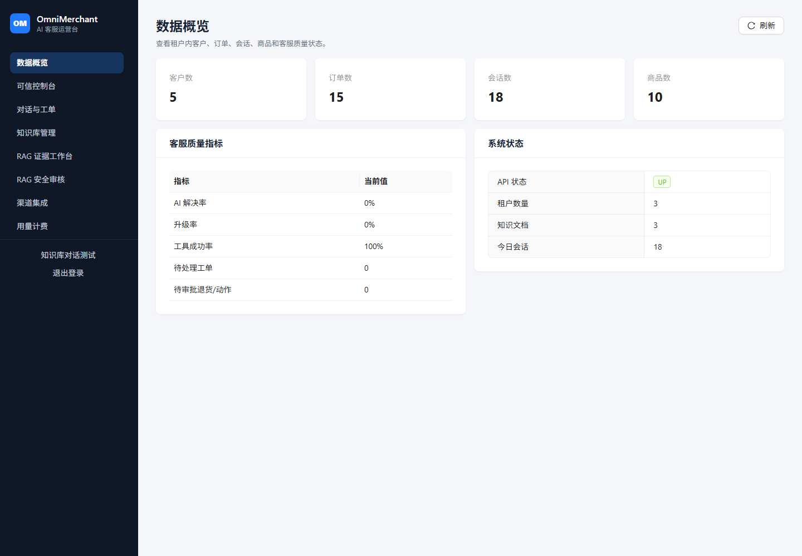
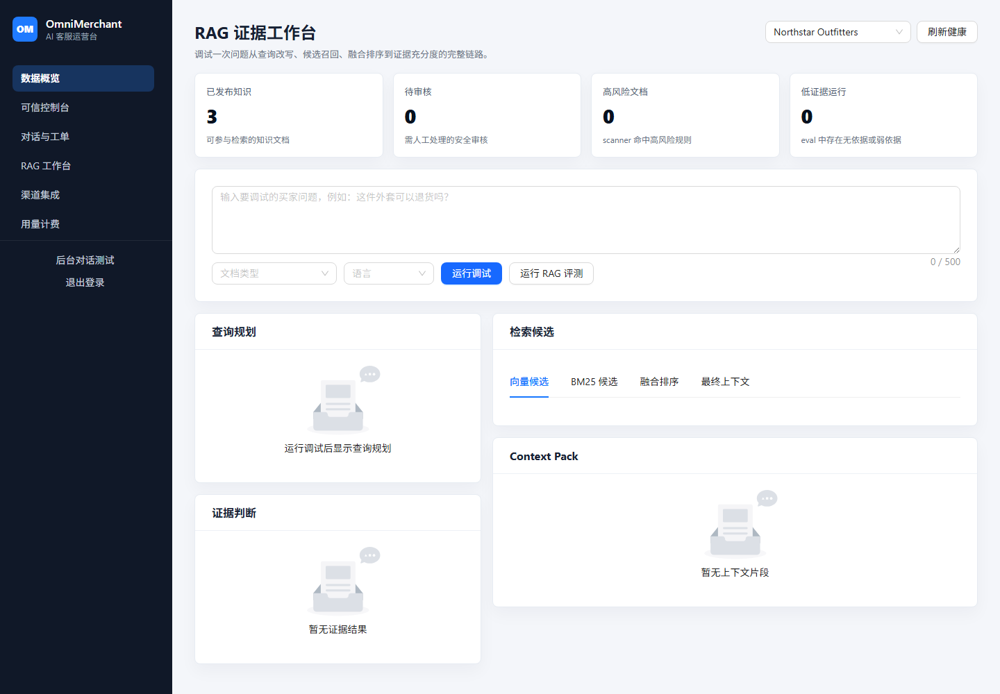
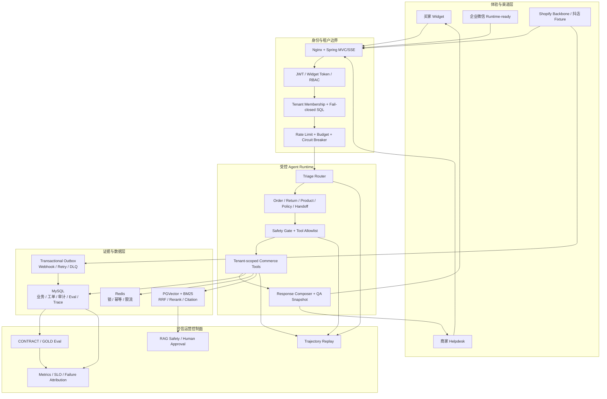

# OmniMerchant

[](https://github.com/RyanCoreAI/spring-ai-crossborder-customer-service/actions/workflows/ci.yml)
[](https://github.com/RyanCoreAI/spring-ai-crossborder-customer-service/actions/workflows/codeql.yml)
[](https://adoptium.net/temurin/releases/?version=21)
[](LICENSE)

**基于 Spring Boot 4 + Spring AI 2 的可信全渠道电商客服平台。**

OmniMerchant 不是只接一个模型的聊天 Demo。它把买家咨询、商家客服工作台、订单与物流工具、人工接管、Evidence-Grade RAG、Agent 评测、轨迹回放、多租户安全和渠道连接器放进同一套可复现工程中。

> 当前定位：**开源旗舰版 + 商业 Beta 候选**。无外部凭据即可运行完整 Fixture 演示；企业微信、抖店和 Shopify 的真实连接状态会被明确区分，不把 Fixture 冒充生产接入。

[快速启动](#5-分钟启动) · [工程架构](#工程架构) · [评测证据](#可核验的技术证据) · [API](docs/openapi.yaml) · [发布边界](docs/v4-release-checklist.md) · [简历写法](#简历写法)

## 90 秒看懂项目

下方动图由当前仓库的真实运行时截图生成，覆盖买家咨询、统一收件箱、RAG Workbench、轨迹回放、评测和可信控制台。


完整录制顺序见 [`scripts/demo-recording.md`](scripts/demo-recording.md)。重新生成证据：

```powershell
.\scripts\capture-screenshots.ps1
.\scripts\create-demo-gif.ps1
```

## 为什么它不只是 RAG Demo

| 能力 | 已实现的工程边界 | 可核验证据 |
|------|------------------|------------|
| 商业客服闭环 | Widget、统一 Inbox、工单、人工接管、内部回复、SLA、CSAT、QA、运营指标 | [`dashboard`](docs/assets/screenshots/dashboard.png) / [`inbox`](docs/assets/screenshots/inbox.png) |
| 受控 Agent | `Triage -> Specialist -> Safety Gate -> Tool -> Response -> QA`；请求级工具白名单和执行前权限校验 | `/admin/agent-workflow`、Agent tests |
| Evidence-Grade RAG | BM25 + Vector + RRF + 邻居窗口 + rerank fallback + context pack + evidence level + citation | [`RAG Workbench`](docs/assets/screenshots/rag-workbench.png) |
| 多租户安全 | JWT tenant membership、Widget 独立 token、MyBatis tenant fail-closed、PGVector tenant filter | [`security-hardening.md`](docs/security-hardening.md) |
| 高风险动作审批 | 退款、取消、改地址、补发只创建内部审批请求，LLM 不直接修改外部平台 | `/admin/actions`、`commerce_action_request` |
| Eval 与回放 | 200 条 deterministic CONTRACT cases；工具选择、参数、引用和失败类别可回放 | [`agent-eval-report.md`](reports/agent-eval-report.md) |
| RAG 安全治理 | Prompt injection、隐藏 HTML/Markdown、PII/secret、跨租户诱导扫描与隔离审核 | [`rag-security.md`](docs/rag-security.md) |
| 多语言证据 | 检测、入站翻译、Agent 输入、出站翻译、provider、耗时和 fallback 原因 | `/admin/multilingual` |
| 渠道与电商连接器 | Web Widget 已实现；企业微信 runtime-ready；抖店 Fixture；Shopify OAuth/Webhook/Sync backbone | `/admin/channels`、`/admin/integrations` |
| 生产工程 | Flyway、Actuator/Prometheus、SLO/告警、审计、数据保留、Docker、CI、CodeQL、Playwright | [`v4-release-checklist.md`](docs/v4-release-checklist.md) |

### 核心界面

| 商家数据概览 | RAG 证据工作台 |
|:--:|:--:|
|  |  |

所有后台截图都来自后端 DTO 和确定性 seed 数据。前端没有写死商业指标、真实连接状态或退款结果。

## 5 分钟启动

### 环境要求

- Docker Desktop
- 源码开发另需 Java 21、Maven 3.8+、Node.js 22
- OpenAI、Anthropic、DeepSeek key 均为可选；没有模型 key 时，管理后台、业务数据、CONTRACT eval 和确定性 RAG 证据仍可运行

### Windows

```powershell
git clone https://github.com/RyanCoreAI/spring-ai-crossborder-customer-service.git
cd spring-ai-crossborder-customer-service

Copy-Item .env.example .env
notepad .env
# 至少设置数据库密码、ADMIN_EMAIL、ADMIN_PASSWORD、JWT_SECRET、
# INTEGRATION_ENCRYPTION_KEY；仓库不提供可部署默认口令。

.\scripts\demo.ps1
```

### Linux / macOS

```bash
git clone https://github.com/RyanCoreAI/spring-ai-crossborder-customer-service.git
cd spring-ai-crossborder-customer-service

cp .env.example .env
# 编辑 .env 中的必填变量
./scripts/demo.sh
```

启动完成后：

| 入口 | 地址 | 使用者 |
|------|------|--------|
| 商家后台 | `http://localhost:5188/login` | 平台管理员、商户管理员、客服主管、客服、只读审计员 |
| 买家咨询 | `http://localhost:5188/widget` | 买家，不使用后台 JWT |
| 健康检查 | `http://localhost:8090/actuator/health` | 开发与运维 |

首次启动由 Flyway 自动迁移 MySQL 与 PostgreSQL/pgvector，并加载 2 个演示租户、10 个客户、20 个商品、30 个订单、客服工单、政策知识和评测数据。角色来自服务端身份与租户 membership，不能由登录页自行选择。

## 工程架构



核心原则：模型只提出工具调用请求，应用负责执行；工具在暴露给模型前和执行前都要经过 tenant、role、identity、risk 与 approval 校验。更多数据边界见 [`docs/architecture.md`](docs/architecture.md)。

## 可核验的技术证据

### Agent CONTRACT Eval

当前提交的报告是无模型 key 也可复现的 deterministic CONTRACT 基线，不冒充人工 GOLD 数据集。

| 租户 | 用例 | 通过率 | Tool Precision | Tool Recall | Citation Coverage | Poisoning Block |
|---:|---:|---:|---:|---:|---:|---:|
| 1001 | 102 | 100% | 99.02% | 100% | 100% | 100% |
| 1002 | 98 | 100% | 100% | 100% | 100% | 100% |

报告：[`Markdown`](reports/agent-eval-report.md) · [`JSON`](reports/agent-eval-report.json) · [`JUnit`](reports/agent-eval-junit.xml)

### RAG Eval

每个检索模式在两个租户各执行 51 条用例。BM25、Hybrid 和 Hybrid+Rerank 均通过当前 CONTRACT 门禁；Vector-only 在默认无 embedding model 环境中保留为诊断结果，不计入通过门禁。

| 模式 | 当前结果 | MRR | nDCG@K | No-answer | Poisoning Block |
|------|----------|-----|--------|-----------|-----------------|
| BM25-only | 102/102 | 0.90-0.91 | 0.90-0.91 | 100% | 100% |
| Hybrid | 102/102 | 0.90-0.91 | 0.90-0.91 | 100% | 100% |
| Hybrid + Rerank | 102/102 | 0.90-0.91 | 0.90-0.91 | 100% | 100% |
| Vector-only | 无 embedding model，诊断模式 | 0 | 0 | 100% | 100% |

报告：[`Markdown`](reports/rag-eval-report.md) · [`JSON`](reports/rag-eval-report.json) · [`JUnit`](reports/rag-eval-junit.xml)

### 本地质量门

```powershell
$env:JAVA_HOME='C:\Program Files\Java\jdk-21'
mvn -q test
mvn -q -DskipTests package

cd omnimerchant-web
npm ci
npm run test
npm run build
npm audit --omit=dev --audit-level=high
npx playwright test
cd ..

docker compose -f compose.demo.yml config --quiet
.\scripts\verify-openapi.ps1
.\scripts\verify-evidence.ps1
```

## 产品使用者与权限

| 使用者 | 身份来源 | 主要能力 |
|--------|----------|----------|
| 平台管理员 | 首次启动 bootstrap 账号，BCrypt 入库 | 平台租户与用户治理 |
| 商户管理员 | `app_user` + `user_tenant_membership` | 当前租户配置、审批和人员管理 |
| 客服主管 | 租户角色 | Inbox、工单分配、QA、SLA、评测与审计 |
| 客服 | 租户角色 | 被授权队列、会话、客户和订单 |
| 只读审计员 | 租户角色 | Trace、Eval、审计和安全证据 |
| 买家 | 短期 `WIDGET_CUSTOMER` token | 当前店铺与会话内的咨询；敏感订单数据需身份校验 |

## 当前真实边界

| 能力 | 状态 | 说明 |
|------|------|------|
| Web Widget + 商家后台 | 已实现 | 本地和 Fixture 演示可运行 |
| 企业微信/微信客服 | Runtime-ready / 等待凭据 | 已有 callbackKey、验签、AES、去重、outbox、重试；尚未声明真实接通 |
| 抖店 | Fixture / 等待凭据 | Fixture 会写入本地 commerce cache；真实 OAuth 和测试店铺属于商业 Beta Gate B |
| Shopify | Connector backbone | OAuth、HMAC、sync job、webhook replay；不是 App Store 生产应用 |
| 退款、取消、改地址、补发 | 仅内部审批 | 默认不执行外部写操作 |
| Agent CONTRACT | 已提交 | 200 条 deterministic cases |
| 人工 GOLD | 门禁未完成 | 必须由具名人工审核、发布并独立出报告 |
| Hosted Demo | 尚未公开 | 发布要求见 [`hosted-demo-runbook.md`](docs/hosted-demo-runbook.md) |

## 技术栈与模块

| 层级 | 技术 |
|------|------|
| 后端 | Java 21、Spring Boot 4.1、Spring AI 2.0、MyBatis-Plus、Spring Security |
| AI / RAG | Tool Calling、Advisor、PGVector、BM25、RRF、rerank fallback、citation、deterministic eval |
| 数据与中间件 | MySQL 8、PostgreSQL 16 + pgvector、Redis 7、RocketMQ、Flyway |
| 可靠性 | Resilience4j Reactor、transactional outbox、idempotency、Actuator、Prometheus |
| 前端 | Vue 3、TypeScript、Ant Design Vue、ECharts、Pinia、Vite、Vitest、Playwright |

```text
omni-merchant-common       shared DTO, auth, exception and trace contracts
omni-merchant-tenant       tenant context, membership and SQL isolation
omni-merchant-agent        orchestration, tools, rate limit, eval and trace
omni-merchant-knowledge    hybrid retrieval, citation and RAG safety
omni-merchant-channel      Widget and external channel adapters
omni-merchant-message      usage and asynchronous message boundaries
omni-merchant-bootstrap    API, Flyway, security and runtime configuration
omnimerchant-web           merchant console and buyer Widget
```

## 文档入口

- [OpenAPI](docs/openapi.yaml)
- [架构与数据边界](docs/architecture.md)
- [安全加固](docs/security-hardening.md)
- [Agent Eval](docs/evals.md)
- [RAG 评测](docs/rag-evaluation.md)
- [RAG 安全与证据质量](docs/rag-security.md)
- [Observability 与 Trace](docs/observability.md)
- [Shopify connector 边界](docs/shopify-production-connector.md)
- [Hosted Demo 发布约束](docs/hosted-demo-runbook.md)
- [v4 发布门禁](docs/v4-release-checklist.md)

## 简历写法

**项目名称：OmniMerchant - 可信全渠道电商客服平台**

> 基于 Java 21、Spring Boot 4 和 Spring AI 2 构建模块化电商客服平台，覆盖多租户隔离、Supervisor-Worker Agent、订单/物流/政策工具、人工接管、Evidence-Grade RAG、确定性评测、轨迹回放和渠道连接器边界。

可按实际岗位选用以下要点：

- 设计 JWT tenant membership + MyBatis tenant interceptor 的 fail-closed 隔离链路，使缺失租户、无权限和跨租户访问分别按 400/401/403 拒绝，并将付费 LLM 限流改为故障时默认拒绝。
- 实现受控 Agent 编排与请求级工具白名单，高风险退款、取消、改地址和补发只生成审批请求；通过 Redis 锁、幂等键、Reactor timeout/retry/circuit breaker 控制重复副作用和流式故障。
- 构建 BM25 + Vector + RRF + 邻居窗口 + rerank fallback 的 RAG 证据链，提供 citation、evidence sufficiency、文档投毒审核、RAG Workbench 和可持久化检索指标。
- 建立 200 条 deterministic Agent CONTRACT 用例和多模式 RAG 回归报告，记录 tool precision/recall、MRR、nDCG、no-answer、poisoning block、P95 latency，并支持失败轨迹回放。
- 完成 Widget、统一 Inbox、工单接管、SLA、QA、动作审批、审计和运营控制面；使用 Vue 3 + Ant Design Vue 展示后端真实 DTO，不在前端编造状态或指标。

不要在简历中写“已达到 Gorgias/Zendesk 商业成熟度”“已接通抖店/企业微信真实商户”或“支撑生产 QPS”，除非已经取得对应线上证据。

## License

[MIT](LICENSE)
