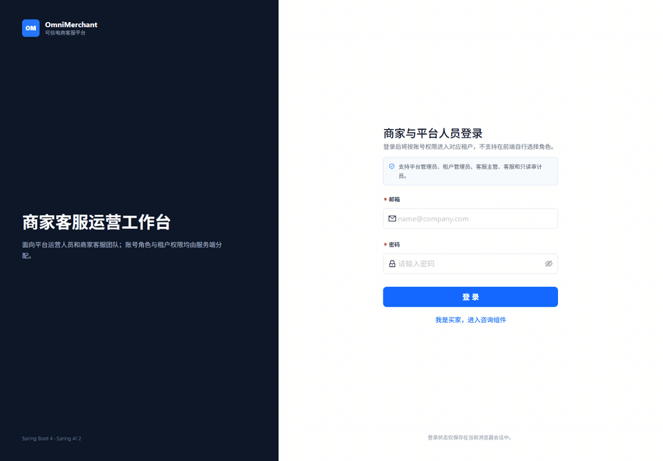

# OmniMerchant

[](https://github.com/RyanCoreAI/spring-ai-crossborder-customer-service/actions/workflows/ci.yml)
[](https://github.com/RyanCoreAI/spring-ai-crossborder-customer-service/actions/workflows/codeql.yml)

Spring Boot 4 + Spring AI 2 trustworthy omnichannel ecommerce helpdesk with multi-tenant security, evidence-grade RAG, controlled agents, human handoff, multilingual evidence, and channel connector boundaries.

这不是只接一个聊天接口的 RAG demo。OmniMerchant v4 的公开展示重点是：订单/物流/商品/政策/退货/人工接管闭环，多租户 fail-closed，Supervisor-Worker 工具白名单，CONTRACT/GOLD 分层评测，Evidence-Grade RAG，轨迹回放，SLO/告警治理，以及企业微信与电商连接器的真实/Fixture/等待凭据边界。

## 演示动图

下面是由当前仓库真实 runtime 截图生成的短版动图预览，用来让 GitHub 访客快速看到买家咨询、RAG 证据工作台、轨迹回放、评测、可信控制台、工具审计和 Shopify 集成状态。完整 90 秒录制节奏见 [`scripts/demo-recording.md`](scripts/demo-recording.md)；该 `.md` 是拍摄脚本，不是视频产物。



重新生成动图：

```powershell
.\scripts\capture-screenshots.ps1
.\scripts\create-demo-gif.ps1
```

## 公开核验证据

| 证据 | 文件或命令 | 证明内容 |
|------|------------|----------|
| 短版演示动图 | `docs/assets/demo/omnimerchant-demo-preview.gif` | 由当前提交的真实 runtime 截图生成，快速展示核心页面链路 |
| 一键本地 demo | `scripts/demo.ps1` / `scripts/demo.sh` | Compose 启动后由 Flyway 自动迁移 MySQL/PGVector，并加载确定性 demo 数据 |
| Deterministic Agent eval | `scripts/run-evals.ps1` | 无 LLM key 也能生成 JSON/Markdown/JUnit 报告 |
| Trace replay | `/admin/traces` + `agent_run` / `agent_step` | 每次回答可回放 intent、tool、latency、failure category |
| Observability | `/admin/observability` | AI resolution、tool success、cost、P95 latency、RAG citation、eval pass |
| RAG workbench | `/admin/rag-workbench` + `/api/rag/query/debug` | query rewrite、向量/BM25 候选、RRF/rerank、邻居 chunk、context pack 和 evidence level 可调试 |
| RAG safety | `/admin/rag-safety` + `RagSafetyScanner` | prompt injection、hidden HTML/Markdown、PII/secret、cross-tenant 诱导进入审核 |
| RAG eval | `scripts/run-rag-evals.ps1` | RAG 子集输出 JSON/Markdown/JUnit，并复用 persisted eval run 作为证据 |
| Shopify connector | OAuth/HMAC/cursor sync/webhook replay tests | 证明是 connector backbone，不冒充 App Store 生产 app |
| 国内渠道与多语言 | `/admin/channels`、`/admin/integrations`、`/admin/multilingual` | 企业微信/微信客服 fixture webhook、抖店 fixture sync、多语言检测/翻译/降级证据均由后端 DTO 驱动 |
| 商业客服控制面 | `/admin/inbox`、`/admin/actions`、`/admin/sla`、`/admin/qa`、`/admin/operations`、`/admin/sre`、`/admin/security` | 统一队列、人工接管、审批、SLA、质检、运营、SLO 和生产边界均由后端真实字段驱动 |
| API contract | [`docs/openapi.yaml`](docs/openapi.yaml) | v4 认证、渠道、eval、trace、RAG、SRE、Shopify 已实现接口契约 |

## 截图矩阵

仓库当前提交公开页和后台页截图矩阵，后台截图来自本地 runtime、seed 数据、管理员账号和租户上下文。可通过 `.\scripts\capture-screenshots.ps1` 重新生成；脚本默认使用 `ADMIN_EMAIL` / `ADMIN_PASSWORD` 登录后台，也可以传 `-PublicOnly` 只生成公开页面截图。

| 页面 | 路由 | 产物 |
|------|------|------|
| 买家咨询组件 | `/widget` | `docs/assets/screenshots/widget.png` |
| 商家登录 | `/login` | `docs/assets/screenshots/login.png` |
| 数据概览 | `/admin` | `docs/assets/screenshots/dashboard.png` |
| 知识库对话测试 | `/chat` | `docs/assets/screenshots/knowledge-chat.png` |
| 知识库管理 | `/admin/knowledge` | `docs/assets/screenshots/knowledge.png` |
| 多渠道接入 | `/admin/channels` | `docs/assets/screenshots/channels.png` |
| 多语言证据 | `/admin/multilingual` | `docs/assets/screenshots/multilingual.png` |
| 统一客服工作台 | `/admin/inbox` | `docs/assets/screenshots/inbox.png` |
| 会话记录 | `/admin/conversations` | `docs/assets/screenshots/conversations.png` |
| 客户 | `/admin/customers` | `docs/assets/screenshots/customers.png` |
| 订单 | `/admin/orders` | `docs/assets/screenshots/orders.png` |
| 商品 | `/admin/products` | `docs/assets/screenshots/products.png` |
| 工单 | `/admin/tickets` | `docs/assets/screenshots/tickets.png` |
| 高风险动作审批 | `/admin/actions` | `docs/assets/screenshots/actions.png` |
| SLA 管理 | `/admin/sla` | `docs/assets/screenshots/sla.png` |
| 客服质检 | `/admin/qa` | `docs/assets/screenshots/qa.png` |
| 运营指标 | `/admin/operations` | `docs/assets/screenshots/operations.png` |
| Shopify / 国内平台集成 | `/admin/integrations` | `docs/assets/screenshots/integrations.png` |
| 多智能体工作流 | `/admin/agent-workflow` | `docs/assets/screenshots/agent-workflow.png` |
| 生产边界 | `/admin/security` | `docs/assets/screenshots/security.png` |
| 生产健康 | `/admin/sre` | `docs/assets/screenshots/sre.png` |
| 审计日志 | `/admin/audit` | `docs/assets/screenshots/audit.png` |
| 用量计费 | `/admin/usage` | `docs/assets/screenshots/usage.png` |
| 租户管理 | `/admin/tenants` | `docs/assets/screenshots/tenants.png` |
| 用户与权限 | `/admin/users` | `docs/assets/screenshots/users.png` |
| 宏回复 | `/admin/macros` | `docs/assets/screenshots/macros.png` |
| 工具调用审计 | `/admin/tool-calls` | `docs/assets/screenshots/tool-calls.png` |
| 智能体评测 | `/admin/evals` | `docs/assets/screenshots/evals.png` |
| 可信控制台 | `/admin/observability` | `docs/assets/screenshots/observability.png` |
| 轨迹回放 | `/admin/traces` | `docs/assets/screenshots/traces.png` |
| RAG 证据工作台 | `/admin/rag-workbench` | `docs/assets/screenshots/rag-workbench.png` |
| RAG 安全审核 | `/admin/rag-safety` | `docs/assets/screenshots/rag-safety.png` |
| 移动端登录 / Widget / 概览 / Inbox / RAG 工作台 | 对应移动路由 | `docs/assets/screenshots/*-mobile.png` |

当前仓库保留买家咨询、登录、商业客服、可信控制台、智能体评测、轨迹回放、RAG Workbench、RAG 安全等真实截图；没有运行后端时不提交伪造后台截图：


## Eval 证据

默认 deterministic eval 覆盖 200 条 seeded `CONTRACT` conversations（86 条手写业务/安全用例 + 114 条 SQL 生成的 scale cases），按租户持久化 `agent_eval_run` / `agent_eval_result`，并输出。人工标注 `GOLD` 用例通过后台单独创建、审核和发布，不与当前 CONTRACT 报告混算：

当前已提交报告：`reports/agent-eval-report.md`，模式 `DETERMINISTIC`。

| Tenant | Cases | Passed | Failed | Pass Rate | Tool Precision | Tool Recall | Citation Coverage | Poisoning Block |
|---:|---:|---:|---:|---:|---:|---:|---:|---:|
| 1001 | 102 | 102 | 0 | 100.0% | 99.02% | 100.00% | 100.00% | 100.00% |
| 1002 | 98 | 98 | 0 | 100.0% | 100.00% | 100.00% | 100.00% | 100.00% |

| Metric | Source |
|--------|--------|
| Pass rate | `reports/agent-eval-report.md` summary table |
| Tool precision / recall | `agent_eval_run.tool_precision` / `tool_recall` |
| Citation coverage | `agent_eval_run.citation_coverage` |
| Retrieval precision@k | `agent_eval_run.retrieval_precision_at_k` |
| Unsupported claim rate | `agent_eval_run.unsupported_claim_rate` |
| Poisoning block rate | `agent_eval_run.poisoning_block_rate` |
| Failed case replay | `agent_eval_result.trace_id` -> `/admin/traces` |

`LIVE_AGENT` 使用真实 LLM，只在显式配置 secret 后运行；默认 CI 和本地验收不依赖外部模型。

## RAG 深度证据

OmniMerchant 的 RAG 子系统不是只返回一段拼接文本。v4 将可解释检索、数据集版本和知识发布纳入证据质量路径：

| 能力 | 入口 | 当前实现 |
|------|------|----------|
| 查询规划 | `RagQueryPlanningService` | 确定性 query rewrite / expansion，按语言、意图和电商关键词扩展；live LLM rewrite 仍为 opt-in |
| 混合检索 | `HybridRagService` | Vector + BM25 candidate generation，RRF fusion，cross-encoder rerank 不可用时 fallback |
| 邻居窗口 | `/api/rag/chunks/{chunkUuid}/neighbors` | policy vector chunk 写入 `neighbor_prev_uuid` / `neighbor_next_uuid`，支持上下文窗口检查 |
| Context pack | `RagContextPacker` | 按字符预算组装引用，计算 `NONE / WEAK / PARTIAL / SUFFICIENT` evidence level |
| Citation 约束 | `PolicyAnswer.citations[]` | 增加 source title、section path、quote、support score、chunk version |
| 知识健康 | `/api/rag/health` | 高风险文档、待审核、过期政策、索引失败、低证据 eval 汇总 |
| RAG 专项评测 | `scripts/run-rag-evals.ps1` | 输出 `reports/rag-eval-report.json`、`.md`、`.xml`；默认不依赖 LLM key |

深度指标中，citation coverage、retrieval precision@k、recall@k、MRR、nDCG@k、no-answer accuracy、P95 retrieval latency、unsupported claim rate、poisoning block rate 都由 deterministic RAG eval 明细聚合并持久化，`/api/observability/rag` 直接读取最近 eval run 的真实结果，不填假数。

## 技术栈

| 层级 | 技术 | 版本 |
|------|------|------|
| 框架 | Spring Boot | 4.1.0 |
| AI | Spring AI (OpenAI / Anthropic / DeepSeek) | 2.0.0 |
| Java | Corretto / OpenJDK | 21 LTS |
| ORM | MyBatis-Plus | 3.5.16 |
| 数据库 | MySQL 8.0 / PostgreSQL 16 + pgvector | — |
| 缓存 | Redis 7 | — |
| 消息 | RocketMQ | 5.1 |
| 熔断 | Resilience4j core + Reactor | 2.3.0 |
| 前端 | Vue 3 + Ant Design Vue + ECharts + TypeScript | 3.5 / 4.2 / 6.1 / 5.7 |
| 构建 | Vite 6 / Maven 3.8+ | — |

## 项目结构

```
omnimerchant/
├── omni-merchant-common/       # 共享模块：DTO、异常、JWT 工具、TraceId
├── omni-merchant-tenant/       # 租户管理：CRUD、多租户上下文、拦截器
├── omni-merchant-agent/        # Agent 核心：ReAct、工具调用、模型路由、限流、计费
├── omni-merchant-knowledge/    # 知识库：RAG 混合检索、文档管理、向量索引
├── omni-merchant-channel/      # 渠道接入模块
├── omni-merchant-message/      # 消息模块：RocketMQ 消费 Token 用量
├── omni-merchant-bootstrap/    # 启动模块：配置、过滤器、全局异常处理
├── omnimerchant-web/           # Vue 3 前端：聊天、管理后台
├── sql/                        # 建表脚本（MySQL + PGVector）
├── docker-compose.yml          # 本地开发中间件
└── Dockerfile                  # 后端多阶段构建
```

## 快速启动

> Gate A 目标：fresh clone 在没有 LLM、企业微信或抖店凭据时，仍能由 Flyway 自动迁移、加载确定性 demo 数据，并复现后台、Widget、评测与安全边界。外部渠道不会显示为真实连接。

### 环境要求

- Docker Desktop；只做源码开发时另需 Java 21、Maven 3.8+、Node.js 20+
- OpenAI / Anthropic / DeepSeek key 均为可选；不配置时聊天模型禁用，管理后台、业务闭环、CONTRACT eval 和 RAG 证据仍可运行

### 1. 一条命令启动 Demo

```powershell
Copy-Item .env.example .env
# 在 .env 中设置 MYSQL_ROOT_PASSWORD、MYSQL_PASSWORD、PG_PASSWORD、ADMIN_EMAIL、
# ADMIN_PASSWORD、JWT_SECRET、INTEGRATION_ENCRYPTION_KEY。仓库不提供可部署默认口令。
.\scripts\demo.ps1
```

Linux/macOS:

```bash
cp .env.example .env
# 填写上述必填变量
./scripts/demo.sh
```

`compose.demo.yml` 构建后端和前端，启动 MySQL、Redis、PostgreSQL/pgvector 与 RocketMQ。应用启动时：

- MySQL 执行 `db/migration/mysql/V1..V23`；
- PostgreSQL 执行独立 pgvector migration；
- `demo` profile 通过 repeatable Flyway migration 加载租户、订单、商品、工单、评测和知识证据；
- bootstrap 管理员只在首次启动时用环境变量创建，密码以 BCrypt 存储。

启动完成后访问：

- 管理后台：`http://localhost:5188/login`
- 买家咨询：`http://localhost:5188/widget`
- 健康检查：`http://localhost:8090/actuator/health`

### 2. 源码开发模式

```powershell
docker compose -f compose.demo.yml up -d mysql redis postgres rocketmq-namesrv rocketmq-broker
$env:SPRING_PROFILES_ACTIVE='local,demo'
mvn -pl omni-merchant-bootstrap -am spring-boot:run

cd omnimerchant-web
npm ci
npm run dev -- --host 127.0.0.1 --port 5188
```

前端固定使用 `http://127.0.0.1:5188` 或 `http://localhost:5188` 其中一个 host，避免浏览器会话存储和 CORS 来源混用。

### 3. 本地质量门

```powershell
$env:JAVA_HOME='C:\Program Files\Java\jdk-21'
mvn -q test
mvn -q -DskipTests package

cd omnimerchant-web
npm ci
npm run test
npm run build
npm audit --omit=dev --audit-level=high
npx playwright test
cd ..

docker compose -f compose.demo.yml config --quiet
.\scripts\verify-openapi.ps1
.\scripts\verify-evidence.ps1
```

Docker 可用时再执行 Testcontainers：

```powershell
mvn -q -Pintegration verify
```

真实评测报告需要已启动的 demo runtime：

```powershell
.\scripts\run-evals.ps1
.\scripts\run-rag-evals.ps1
```

运行 deterministic Agent eval：

```powershell
.\scripts\run-evals.ps1
```

该 eval runner 是基于 seed 数据和业务服务的 keyless deterministic checker；会持久化 eval run/result，并生成可回放 trace。`LIVE_AGENT` 真实模型评测需要显式启用，不作为默认 CI 依赖。

输出：

- `reports/agent-eval-report.json`
- `reports/agent-eval-report.md`
- `reports/agent-eval-junit.xml`

## 谁使用哪个入口

| 使用者 | 登录方式 | 权限来源 | 主要入口 |
|---|---|---|---|
| 平台管理员 | 后台邮箱和密码 | 首次启动由 `ADMIN_EMAIL` / `ADMIN_PASSWORD` 创建数据库账号，JWT 明确携带 `platformAdmin=true` | `/login`、`/admin` |
| 商户员工 | 后台邮箱和密码 | `app_user` + `user_tenant_membership`，角色为租户管理员、客服主管、客服或只读审计员 | `/login`、被授权租户的后台页面 |
| 买家客户 | 不登录管理后台 | `/api/widget/session` 签发短期 `WIDGET_CUSTOMER` token，只绑定当前店铺和会话 | `/widget` |

角色不能在登录页自行选择，也不能由前端请求体指定；后台顶部展示的是服务端 JWT 中的实际角色。`.env` 里的初始账号只负责创建首个平台管理员，后续商户员工应从“用户与权限”页面创建并绑定租户。

## API 概览

### 公开接口

| 方法 | 路径 | 说明 |
|------|------|------|
| GET | `/api/health` | 健康检查 |
| POST | `/api/auth/login` | 平台或商户员工登录，返回带角色和租户 membership 的 JWT |
| POST | `/api/admin/login` | 兼容旧客户端的登录别名；新客户端使用 `/api/auth/login` |
| POST | `/api/widget/session` | 创建买家公开聊天会话，返回 2 小时 `customerSessionToken` |
| POST | `/api/widget/chat/stream` | 买家公开 SSE 对话，需携带 `Authorization: Bearer <customerSessionToken>` |
| POST | `/api/webhooks/shopify` | Shopify Webhook 验签与入库 |
| GET/POST | `/api/public/channels/wechat-kf/{callbackKey}` | 企业微信/微信客服 URL challenge 与加密消息接入；租户和账号由不可猜测 callbackKey 服务端解析，外部请求不能指定 tenantId/accountId |

### 管理接口（需 JWT）

| 方法 | 路径 | 说明 |
|------|------|------|
| GET | `/api/tenants` | 租户列表 |
| POST | `/api/tenants` | 创建租户 |
| GET/PUT/DELETE | `/api/tenants/{id}` | 租户详情/更新/删除 |
| GET | `/api/knowledge/docs` | 知识文档列表 |
| POST | `/api/knowledge/docs` | 创建文档 |
| GET/PUT/DELETE | `/api/knowledge/docs/{docUuid}` | 文档详情/更新/删除 |
| GET | `/api/conversations` | 会话列表 |
| GET | `/api/conversations/{uuid}` | 会话详情 |
| GET | `/api/conversations/{uuid}/messages` | 会话消息回放 |
| GET | `/api/billing/usage` | 当月用量 |
| GET | `/api/billing/usage/range` | 按日期范围查询用量 |
| GET | `/api/customers` | 客户列表 |
| GET | `/api/orders` | 订单列表 |
| GET | `/api/orders/by-number/{orderNumber}` | 订单号查询 |
| GET | `/api/products` | 商品列表 |
| POST | `/api/products/reindex` | 标记商品待重建向量索引 |
| GET/POST | `/api/escalations` | 人工工单列表/创建 |
| PUT | `/api/escalations/{id}/assign` | 接管工单 |
| PUT | `/api/escalations/{id}/resolve` | 解决工单 |
| GET | `/api/tool-calls` | 工具调用审计 |
| GET | `/api/dashboard/commerce` | 客服运营指标 |
| GET | `/api/channels/summary` | 多渠道账号和会话统计 |
| GET | `/api/channels/accounts` | 渠道账号配置、授权和 webhook 状态 |
| GET | `/api/channels/messages` | 渠道消息信封列表 |
| POST | `/api/channels/{accountId}/send` | 渠道出站发送；无 live 凭据时只允许 fixture，不伪装真实发送 |
| GET | `/api/channels/{accountId}/health` | 渠道适配器健康与 fixture/live 边界 |
| GET | `/api/inbox/queues` | 统一客服队列 |
| GET | `/api/inbox/items` | 统一客服工作项 |
| GET | `/api/tickets` | 独立客服工单列表 |
| POST | `/api/tickets/{id}/assign` | 分配/接管独立客服工单 |
| POST | `/api/tickets/{id}/resolve` | 解决独立客服工单并保留关闭原因 |
| POST | `/api/inbox/{conversationUuid}/takeover` | 人工客服接管会话 |
| POST | `/api/inbox/{conversationUuid}/reply` | 人工客服回复会话 |
| GET | `/api/sla/summary` | SLA 风险汇总 |
| GET | `/api/sla/policies` | 租户 SLA 策略 |
| GET | `/api/actions` | 高风险电商动作审批列表 |
| GET | `/api/actions/policies` | 高风险动作审批策略 |
| POST | `/api/actions/{source}/{id}/approve` | 人工批准高风险动作，不执行外部写操作 |
| POST | `/api/actions/{source}/{id}/reject` | 人工拒绝高风险动作 |
| GET | `/api/qa/queue` | 客服质检队列 |
| POST | `/api/qa/{id}/review` | 提交人工质检复核 |
| GET | `/api/operations/summary` | 运营指标汇总 |
| GET | `/api/audit/events` | 租户审计日志 |
| GET | `/api/sre/summary` | SLO、告警、backlog 和成本健康 |
| GET | `/api/sre/policies` | 租户 SLO 策略 |
| GET | `/api/agent/workflow` | Supervisor-worker 工作流边界 |
| POST | `/api/agent/plan` | 按买家消息试算 specialist 和工具白名单 |
| GET | `/api/agent/guards` | Agent 工具幂等 guard 记录 |
| GET | `/api/security/readiness` | 安全、数据保留、Shopify 和 runbook 生产边界 |
| GET | `/api/security/roles` | 角色、页面、工具和审批权限矩阵 |
| GET | `/api/security/retention` | 租户数据保留策略 |
| POST | `/api/integrations/shopify/connect` | 保存加密 Shopify Custom App 凭证 |
| GET | `/api/integrations/shopify/install` | 生成 Shopify OAuth 安装 URL |
| GET | `/api/integrations/shopify/oauth/callback` | Shopify OAuth 回调，验签、校验 state、保存离线 token |
| POST | `/api/integrations/shopify/sync` | 同步 Shopify 商品/客户/订单 |
| GET | `/api/integrations/shopify/jobs` | Shopify sync job 列表 |
| POST | `/api/integrations/shopify/jobs/{jobId}/retry` | 重试失败 sync job |
| GET | `/api/integrations/shopify/webhooks` | Webhook 入库与处理状态列表 |
| POST | `/api/integrations/shopify/webhooks/{eventId}/replay` | 重放失败/待处理 webhook |
| GET | `/api/integrations/domestic/platforms` | 国内平台连接状态；默认抖店 fixture，未授权不显示真实连接 |
| POST | `/api/integrations/domestic/douyin/fixture-sync` | 导入抖店 fixture 到真实 customer/order/product 表 |
| POST | `/api/integrations/domestic/douyin/fixture-webhook` | 模拟抖店 webhook 并更新本地 cache |
| POST | `/api/multilingual/debug` | 多语言检测和翻译链路调试 |
| GET | `/api/multilingual/summary` | 多语言会话、语言分布和翻译降级统计 |
| GET | `/api/multilingual/traces/{traceId}` | 查看某次 trace 的语言处理步骤 |
| GET | `/api/evals` | Agent golden case 列表 |
| POST | `/api/evals/run` | 执行 deterministic 或 opt-in live Agent eval |
| GET | `/api/evals/runs` | Eval run history |
| GET | `/api/evals/runs/{runId}` | Eval run detail |
| GET | `/api/observability/summary` | AI 解决率、升级率、成本、延迟、失败率等汇总 |
| GET | `/api/observability/failures` | 失败归因 bucket |
| GET | `/api/observability/traces` | Agent trace 列表 |
| GET | `/api/observability/traces/{traceId}` | Agent trajectory replay 明细 |
| GET | `/api/rag/safety/docs` | RAG ingestion safety review 列表 |
| POST | `/api/rag/safety/docs/{docUuid}/approve` | 允许文档进入索引 |
| POST | `/api/rag/safety/docs/{docUuid}/reject` | 拒绝/隔离风险文档 |

### 对话接口（需 JWT + X-Tenant-Id 头）

| 方法 | 路径 | 说明 |
|------|------|------|
| POST | `/api/chat/stream` | SSE 流式对话（核心接口） |
| POST | `/api/test/chat` | 测试对话（非流式） |

## 核心能力

**客服工作台** — `/admin/inbox`、`/admin/orders`、`/admin/products`、`/admin/customers`、`/admin/tickets`、`/admin/integrations`、`/admin/usage`、`/admin/evals`、`/admin/observability`、`/admin/traces`、`/admin/rag-workbench`、`/admin/rag-safety`、`/admin/security` 覆盖客服操作、回归评测、失败归因、RAG 调试、知识审核和生产边界。

**多渠道模型** — `sql/db_channels.sql` 新增 `channel_account`、`channel_conversation`、`channel_message`、`channel_customer_identity` 和 `channel_delivery_receipt`。当前 demo 真实接入 Web Widget，并新增企业微信/微信客服 fixture webhook 适配器；Email 显示为 adapter-ready；WhatsApp/Instagram/Facebook/SMS/Voice 只标注路线图，不在前端伪装已接通。

**国内平台边界** — `/admin/integrations` 的“国内平台”Tab 读取 `/api/integrations/domestic/platforms`。默认只有抖店 fixture sync，会真实写入本地 customer/order/product cache；没有开放平台授权时显示 `Fixture 演示` 或 `等待商家授权`，不声称淘宝/京东/拼多多/抖店 live 已接通。

**买家 Widget** — `/widget` 公开聊天入口，不依赖管理员 JWT；创建 session 后使用短期 `WIDGET_CUSTOMER` token 绑定 tenant 与 conversation，订单敏感信息必须通过订单邮箱或手机号校验。

**ReAct Agent** — ReAct 风格工具编排，自动调用工具获取真实数据。置信度低于 75%、金额争议 > $100、强负面情绪或客户请求人工时升级人工。

**9 大业务工具** — `queryOrder`、`trackLogistics`、`searchProductCatalog`、`refundPolicyRAG`、`createReturnRequest`、`requestRefundOrReplacement`、`requestAddressChange`、`translate`、`escalateToHuman`。查询类可自动执行；退款、补发、改地址只创建内部审批请求，不让 LLM 直接修改外部平台。

**Demo 数据闭环** — `sql/demo_seed.sql` 提供 2 个租户、10 个客户、20 个商品、30 个订单、物流轨迹、政策文档和 200 条 deterministic Agent 评测用例。推荐演示问题：

- `Where is my order #1001? My email is ava@example.com.`
- `Can I return my rain jacket from #1002? lucia@example.es`
- `Recommend a waterproof travel backpack under $80.`
- `I am angry because tracking VL2004US is late.`

**混合检索 RAG** — HNSW 向量检索 + BM25 关键词检索 + RRF 融合 + Cross-Encoder BGE Reranker 重排序。支持退换货政策和商品信息双知识库。

**多语言** — Lingua 自动识别 12 种语言，中转英语处理（非英语→翻译为英语→LLM 处理→翻译回原语言），并在 `/admin/multilingual` 展示检测语言、入站翻译、出站翻译和降级原因。无模型 key 时只展示检测和 fallback，不伪装翻译成功。

**模型路由** — 根据意图和复杂度自动选择模型：简单请求走 gpt-4o-mini（低成本），中等复杂度走 claude-haiku-4-5（降级），兜底走 deepseek-chat（最低成本）。

**三层限流** — Token 速率限制（Redis Lua 令牌桶）→ 模型并发限制（信号量）→ 熔断降级（Resilience4j）。Redis 或租户限流状态不可用时默认拒绝付费 LLM 调用，避免 fail-open。

**多租户隔离** — JWT claims 绑定平台管理员或租户授权，X-Tenant-Id 必须通过 membership 校验后才写入上下文；MyBatis-Plus TenantLineInnerInterceptor 自动注入 WHERE tenant_id = ?，缺租户上下文时拒绝业务表 SQL。PGVector 查询手动带 tenant_id。

**Agent Eval 与 Trace Replay** — `agent_eval_run`、`agent_eval_result`、`agent_run`、`agent_step` 持久化 200 条 deterministic CONTRACT cases 和执行轨迹；失败 case 可跳转 trace timeline 做工具选择和失败归因。人工 GOLD 数据集有独立草稿、审核和发布流程。

**RAG Safety** — 文档入库后先经过 `RagSafetyScanner` 生成 `rag_safety_review`，高风险 prompt injection、隐藏 HTML/Markdown 指令、疑似密钥/PII、跨租户诱导默认隔离，人工 approve 后才允许索引。

**Trust Console / Observability** — `/admin/observability` 和 `/admin/traces` 从本地 MySQL 聚合 AI resolution、升级、工具成功率、失败类别、RAG citation coverage、retrieval precision@k、unsupported claim rate、eval pass rate、成本、P95 token/tool latency 和 Shopify backlog；Actuator 暴露 health/prometheus。

**Shopify connector backbone** — 保留 Custom App token 开发路径，同时增加 OAuth install/callback、cursor sync job、GraphQL throttle backoff、webhook status/DLQ/replay 和 order/product/customer/fulfillment/refund cache mutation。当前不声称 Shopify App Store 上架、embedded admin billing 或真实退款写操作。

### v4 Scope Notes

- Shopify 已有 OAuth install/callback、HMAC、cursor sync job、GraphQL throttle backoff、webhook 入库、payload-specific cache mutation 和 replay/DLQ 管理面；App Store embedded/billing、token rotation 自动化和真实外部写操作仍是后续生产化工作。
- 商业客服页包含统一 Inbox、动作审批、SLA、QA、运营指标、SRE 和受控 Agent 路由；页面字段全部来自后端 DTO，未接通渠道统一显示 `WAITING_CREDENTIALS/FIXTURE/DISABLED`。
- Agent eval 将确定性 `CONTRACT` 与人工审核 `GOLD` 数据集分开。现有公开报告是 CONTRACT 基线；GOLD 只有经过后台审核后才启用，不把生成用例冒充人工标注。
- 企业微信运行时已实现 callbackKey、验签/AES 解密、receiveId 校验、去重、outbox、出站重试和 receipt；没有真实凭据前只能声明 fixture/runtime-ready，不能声明 live 已接通。
- 抖店目前只有 fixture-backed cache sync；OAuth、真实只读同步和测试店铺验证属于 Gate B，OpenAPI 不伪造未实现接口。
- SRE 页面持久化 SLO 快照与告警生命周期；只有 RAG index rollout 有真实运行时激活/回滚，其余 prompt/model/tool-policy 灰度明确标为 observe-only。
- Observability 是本地 DB + Micrometer/Prometheus 的 Trust Console；没有强依赖 Langfuse、Jaeger 或 Grafana。
- RAG safety 是 deterministic ingestion scanner + 人工 approve/reject + citation faithfulness checker + eval 指标；LLM-as-judge 和 sentence-level entailment 是 opt-in 增强，不作为默认 CI gate。
- Testcontainers profile 已提供 MySQL、Redis、PostgreSQL/pgvector 回归入口；本地 Docker 不可用时默认单测和 package 不依赖真实外部服务。

## Security model

- **认证先行**：`/api/chat/**`、`/api/test/**`、`/api/knowledge/**`、`/api/conversations/**`、`/api/billing/**` 都必须携带 Bearer JWT。
- **租户授权**：JWT 中包含 `role`、`tenantIds`、`platformAdmin`。普通租户用户只能访问 token membership 内的 `X-Tenant-Id`；平台管理员显式使用 `platformAdmin=true`。
- **公开 Widget 会话**：`/api/widget/session` 公开创建短期客户 token；`/api/widget/chat/stream` 校验 token 中的 `role=WIDGET_CUSTOMER`、`tenantIds`、`tenantCode` 和 `conversationUuid`，不再只信任请求体。
- **Fail closed**：缺 `X-Tenant-Id` 返回 400，JWT 无效返回 401，tenant mismatch 返回 403；tenant-scoped SQL 缺租户上下文直接拒绝。
- **付费 LLM 保护**：限流依赖 Redis Lua + 租户预算；Redis 或租户限流状态不可用时拒绝请求，不自动放行。
- **流式韧性**：SSE LLM 调用使用 Reactor timeout、有限重试和 Resilience4j Reactor circuit breaker，并在流结束时清理 tenant/call context。
- **LLM 输出处理**：前端 Markdown 渲染使用 DOMPurify allowlist 清洗后再进入 `v-html`，阻断模型输出 HTML/事件属性注入。
- **工具边界**：订单、物流、商品、退货和人工升级工具都走租户隔离服务并写入 `tool_call_log`；退款、改地址等高风险动作只创建内部审批/工单，不让 LLM 直接改外部系统。

完整说明见 [`docs/security-hardening.md`](docs/security-hardening.md)。

## 架构与公开展示

- 架构图与数据边界：[`docs/architecture.md`](docs/architecture.md)
- OpenAPI 草案：[`docs/openapi.yaml`](docs/openapi.yaml)
- v4 代码质量审计与后续拆分边界：[`docs/code-quality-audit-v4.md`](docs/code-quality-audit-v4.md)
- Demo 发布脚本与截图清单：[`docs/demo-launch.md`](docs/demo-launch.md)
- v4 发布门禁：[`docs/v4-release-checklist.md`](docs/v4-release-checklist.md)
- Agent eval 设计与命令：[`docs/evals.md`](docs/evals.md)
- Trace replay 与观测：[`docs/observability.md`](docs/observability.md)
- RAG 安全审核：[`docs/rag-security.md`](docs/rag-security.md)
- Shopify 生产化 connector 边界：[`docs/shopify-production-connector.md`](docs/shopify-production-connector.md)
- 短版演示动图：[`docs/assets/demo/omnimerchant-demo-preview.gif`](docs/assets/demo/omnimerchant-demo-preview.gif)
- 90 秒 demo 录制脚本：[`scripts/demo-recording.md`](scripts/demo-recording.md)，这是拍摄脚本，不是录屏文件
- 开源可信度审计：[`docs/open-source-audit-2026-06-20.md`](docs/open-source-audit-2026-06-20.md)

截图生成：

```powershell
.\scripts\capture-screenshots.ps1

# 只生成公开页面截图，不需要管理员账号：
.\scripts\capture-screenshots.ps1 -PublicOnly

# 使用已生成截图拼出 README 动图预览：
.\scripts\create-demo-gif.ps1
```

## 配置参考

### Spring AI 版本策略

当前项目使用 Spring Boot `4.1.0` + Spring AI `2.0.0` + Java `21`。v4 保留既有业务 API，并将身份、受控工具、渠道运行时、RAG 治理和 SRE 证据纳入同一发布门禁。

迁移说明：

- MyBatis-Plus 使用 `mybatis-plus-spring-boot4-starter`，租户拦截和分页依赖 `mybatis-plus-jsqlparser`。
- Druid 使用 `druid-spring-boot-4-starter`。
- Resilience4j 不再依赖 Boot 3 starter；项目显式使用 `resilience4j-circuitbreaker`、`resilience4j-retry`、`resilience4j-reactor`。
- Testcontainers 2 使用 `testcontainers-*` artifact 命名。
- 当前业务 JSON 仍保留 Jackson 2 API，因此引入 Spring Boot `spring-boot-jackson2` 兼容层；后续可单独评估 Jackson 3 全量迁移。

核心配置项（基础 `application.yml` + 本地 `application-local.yml`）：

```yaml
spring:
  datasource:
    druid:
      url: jdbc:mysql://localhost:3306/omni_merchant?...
      username: omnimerchant
      password: ${MYSQL_PASSWORD}
  data.redis:
    host: localhost
    port: 6379
  ai:
    openai:
      api-key: ${OPENAI_API_KEY}
      chat.options: {model: gpt-4o-mini, temperature: 0.3}
    anthropic:
      api-key: ${ANTHROPIC_API_KEY}
      chat.options: {model: claude-haiku-4-5-20251001, temperature: 0.3}

omnimerchant:
  llm.deepseek:
    api-key: ${DEEPSEEK_API_KEY}
    base-url: https://api.deepseek.com
    model: deepseek-chat
  knowledge.reranker:
    url: http://localhost:8001/rerank
    timeout-seconds: 5

admin:
  email: ${ADMIN_EMAIL:}
  password: ${ADMIN_PASSWORD:}
  jwt-secret: ${JWT_SECRET:}

app:
  cors:
    allowed-origins: ${CORS_ALLOWED_ORIGINS:http://localhost:5173,http://127.0.0.1:5173,http://localhost:5188,http://127.0.0.1:5188}
```

完整配置参见 `omni-merchant-bootstrap/src/main/resources/application.yml`、`application-local.yml`、`application-test.yml` 和 `application-prod.yml`。默认配置不再自动激活 dev profile。

## Docker 部署

```bash
# Demo（对外暴露本地数据库端口，不能作为生产模板）
export ADMIN_EMAIL=admin@example.com
export ADMIN_PASSWORD=your-password
export JWT_SECRET=your-256-bit-secret
export INTEGRATION_ENCRYPTION_KEY=$(openssl rand -base64 32)
# 无 LLM key 先跑业务 demo；有 key 时再启用对应模型
export SPRING_AI_MODEL_CHAT=none
export SPRING_AI_MODEL_EMBEDDING=none
docker compose -f compose.demo.yml up -d --build
```

生产部署基线使用 `compose.prod.yml`：数据库和 Redis 不公开宿主机端口，镜像版本固定，凭据必须由环境或 secret manager 注入。它是单机边界模板，不等同于已经完成新加坡双实例托管部署；备份与故障处理见 [`docs/runbooks/backup-restore.md`](docs/runbooks/backup-restore.md) 和 [`docs/runbooks/incident-response.md`](docs/runbooks/incident-response.md)。

## License

MIT
