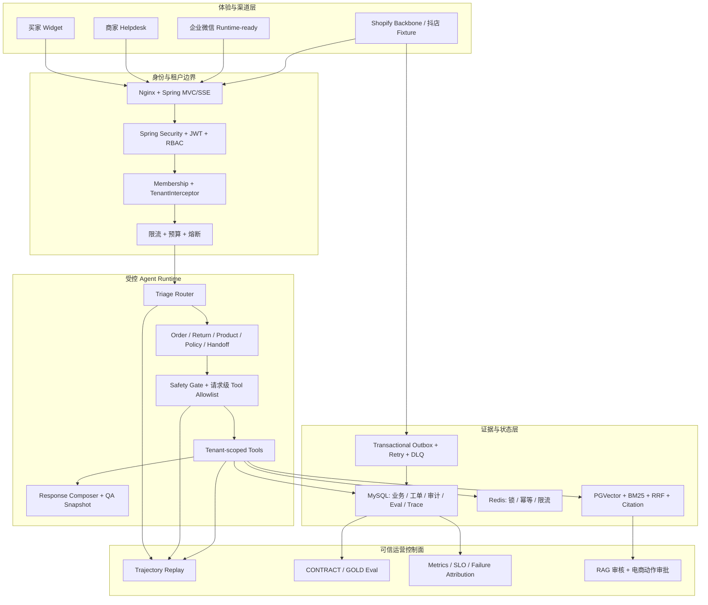

# OmniMerchant v4 工程架构

OmniMerchant 是一个基于 Spring Boot 4 + Spring AI 2 的模块化单体。客服工作流、Agent 运行时、证据链和连接器共享同一套明确的租户与事务边界，避免为了展示技术而过早拆分微服务。

## 系统全景



## 请求执行链路

1. 买家 Widget 获得只绑定一个 tenant code 和 conversation 的短期 `WIDGET_CUSTOMER` token；商家用户由 Spring Security 登录，角色和租户 membership 来自数据库身份记录。
2. `X-Tenant-Id` 只是请求访问的租户范围，不是授权凭证。服务端验证 principal membership 后才写入 tenant context。
3. Orchestrator 生成确定性的 specialist plan，`AgentExecutionGuardService` 在模型看到工具前过滤 Spring AI `ToolCallback`。
4. 每次工具执行都会再次校验 tenant、specialist allowlist、买家身份、风险级别、审批策略和幂等要求。
5. 查询工具读取租户范围内的 commerce cache 或 RAG 证据；退款、取消、改地址和补发只创建内部审批记录，不产生外部副作用。
6. 路由、工具摘要、引用、延迟和失败分类持久化，用于 Trace Replay、Eval 和运营聚合。
7. SSE 正常结束、取消、超时或异常时，Reactor cleanup 会清理 tenant 和 call context。

## 存储边界

| 存储 | 责任 | 隔离与可靠性 |
|------|------|--------------|
| MySQL | 身份、租户、交易缓存、会话、工单、审批、审计、Eval、Trace | MyBatis tenant interceptor 对业务表 fail closed；Flyway 管理 schema 和 demo data |
| PostgreSQL + pgvector | 政策与商品 embedding | 每个查询显式携带 tenant metadata；隔离或过期文档不参与召回 |
| Redis | 付费调用限流、会话锁和短期协调 | 限流状态缺失时拒绝付费 LLM 调用；数据库唯一 guard 防止重复业务动作 |
| Transactional outbox | Connector 和 Webhook 工作项 | 入站状态与 outbox 意图同事务提交；重试与 DLQ 不绕过幂等校验 |
| RocketMQ | 可替换异步传输层 | 不是业务事实来源，outbox 状态保持权威 |

## 可信控制

- **Evidence-Grade RAG**：query planning、BM25/vector candidates、RRF、neighbor expansion、可选 rerank、context packing、evidence sufficiency、citation validation、poisoning review 和 deterministic metrics。
- **受控自主性**：模型只请求工具，应用代码决定可见 callback，并在策略约束下执行。
- **人工审批**：高风险电商动作和高风险知识摄入均保留可审核记录。
- **隐私**：Trace 和 observation 默认只保存脱敏摘要，默认不导出原始 prompt 和完整工具内容。
- **评测分层**：生成的 `CONTRACT` 与人工审核的 `GOLD` 数据集拥有独立生命周期和报告；当前公开证据仍是 CONTRACT。

## Connector 状态

| Connector | 当前状态 | 对外口径 |
|-----------|----------|----------|
| Web Widget | 已实现 | 使用短期客户 token 的本地/演示公开渠道 |
| 企业微信/微信客服 | Runtime-ready / 等待凭据 | callback key、验签、AES、receive-id 校验、去重、outbox 和重试已实现；Gate B 前不声明 live |
| 抖店 | Fixture / 等待凭据 | 只证明 fixture-backed 本地 cache mutation |
| Shopify | Connector backbone | OAuth、HMAC、cursor sync、throttle handling 和 webhook replay；不是 App Store 生产应用 |

## 模块职责

```text
omni-merchant-common       共享契约、JWT 与 Trace 基础设施
omni-merchant-tenant       Tenant Context 与 SQL 隔离
omni-merchant-agent        编排、工具、Helpdesk、Eval 与 Observability
omni-merchant-knowledge    检索、引用、知识摄入与 RAG Safety
omni-merchant-channel      外部渠道协议适配器
omni-merchant-message      异步用量边界
omni-merchant-bootstrap    API、身份、安全、Flyway 与运行时装配
omnimerchant-web           商家控制台与买家 Widget
```

只有在真实扩展压力或团队所有权边界出现后，connector adapter 和消息传输层才考虑独立部署；当前模块化单体更利于维护事务一致性和租户安全。
