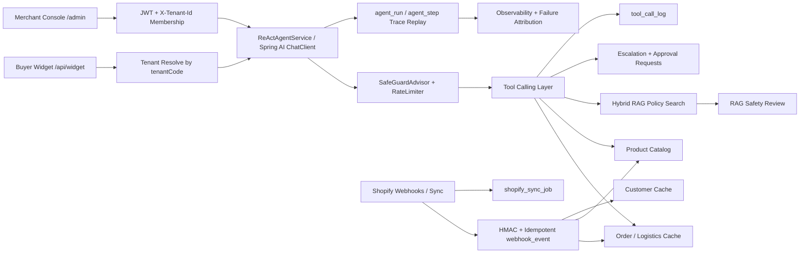
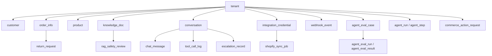

# OmniMerchant Architecture

OmniMerchant is a Spring AI cross-border ecommerce customer-service platform. It is organized around a tenant-safe commerce cache, an AI agent tool layer, and a merchant helpdesk console.

## Runtime Flow

## Data Boundaries

All business tables are tenant-scoped. `tenant` is the only global table ignored by the MyBatis tenant interceptor.

## Safety Model

- Admin API calls require JWT before tenant context is accepted.
- `X-Tenant-Id` is an input hint, not authority; membership is verified from JWT claims.
- Public widget sessions resolve tenant by public tenant code and still require order email or phone for order details.
- Query tools may return data after verification.
- Refund, replacement, return, cancellation, and address-change flows create internal approval requests only.
- Shopify webhook deliveries require HMAC validation and idempotent event recording.
- Tool calls are logged for audit, latency, success rate, eval scoring, and trace replay.

## Demo Data

`sql/demo_seed.sql` creates:

- 2 tenants: `OM-FASHION`, `OM-ELECTRO`
- 10 customers
- 20 products
- 30 orders with realistic statuses and tracking histories
- policy documents
- widget channel installs
- 80 eval cases covering normal and adversarial scenarios

## Extension Points

- Add new ecommerce platforms behind integration services, not inside agent tools.
- Keep external write operations behind approval records until a human or policy engine authorizes them.
- Add channel adapters under `omni-merchant-channel` when email, WhatsApp, or platform chat support is implemented.
