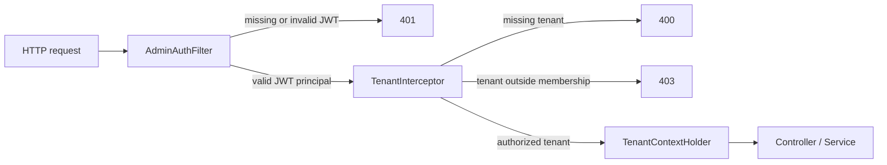

# OmniMerchant Security Hardening

This document describes the security boundaries that make OmniMerchant more than a generic RAG demo.

## Request Boundary

Tenant-scoped and paid LLM endpoints require both a valid JWT and `X-Tenant-Id`.



JWT claims include:

| Claim | Meaning |
|---|---|
| `sub` | Authenticated user identifier |
| `role` | Current coarse-grained role |
| `tenantIds` | Tenant memberships for tenant users |
| `platformAdmin` | Explicit cross-tenant admin authority |

Public buyer widget traffic uses a separate short-lived JWT boundary. `POST /api/widget/session` is public and returns a 2-hour `customerSessionToken` with `role=WIDGET_CUSTOMER`, `tenantIds`, `tenantCode`, and `conversationUuid`. `POST /api/widget/chat/stream` must present that token and the request body must match the signed tenant and conversation claims.

## Data Isolation

MyBatis-Plus `TenantLineInnerInterceptor` injects `tenant_id` for tenant-scoped tables. The handler now fails closed when tenant context is missing. The only table-level ignore is the global `tenant` table; tables such as `knowledge_doc`, `conversation`, `chat_message`, `token_usage_daily`, `escalation_record`, and `rate_limit_record` stay tenant-scoped.

PGVector retrieval remains manually filtered by tenant because it uses a separate PostgreSQL datasource.

## Paid LLM Protection

LLM calls are protected by:

- JWT and tenant membership before controller execution.
- Redis-backed Lua rate limiting for QPS, monthly token budget, and concurrent sessions.
- Fail-closed behavior when tenant lookup, Redis, or the Lua script is unavailable.
- Reactor timeout, one pre-emission retry, and Resilience4j Reactor circuit breaker for streaming calls.

The `/api/test/chat` endpoint also routes through the same rate-limited model path.

## OWASP LLM Controls

The hardening targets the OWASP Top 10 for LLM Applications 2025 risk classes most relevant to OmniMerchant:

- Prompt injection: suspicious jailbreak/system-override inputs are rejected before model calls, and oversized inputs are capped.
- Sensitive information disclosure: credit-card and SSN-like values are masked before LLM submission.
- Improper output handling: chat Markdown is sanitized with a DOMPurify allowlist before rendering through `v-html`.
- Excessive agency and misinformation: LLM tools require tenant context, read from tenant-scoped commerce services, and write `tool_call_log`; high-risk actions such as refund, replacement, and address change create internal approval records instead of mutating external systems directly.
- Data/model poisoning: knowledge ingestion and RAG retrieval require tenant context; PGVector queries and embedding cache keys are tenant-scoped. New or updated knowledge documents are scanned by `RagSafetyScanner`; risky prompt-injection, hidden instruction, secret/PII, or cross-tenant leakage patterns are quarantined until manually approved.

## Test Coverage

Default tests cover:

- JWT claims and tamper rejection.
- Widget customer token creation, expiry, mismatch, and stream access rejection.
- Filter and interceptor status codes: 400, 401, 403.
- MyBatis tenant handler fail-closed behavior.
- Rate limiter fail-closed behavior.

Integration tests run under:

```bash
mvn -q -Pintegration verify
```

They use Testcontainers for MySQL, PostgreSQL/pgvector, and Redis, and keep RocketMQ mocked out of the first integration gate.
